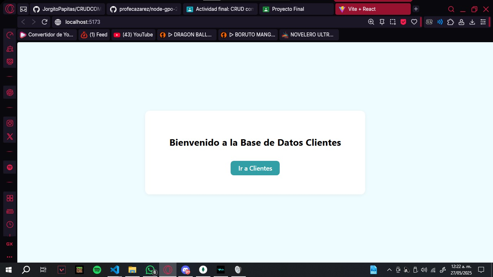
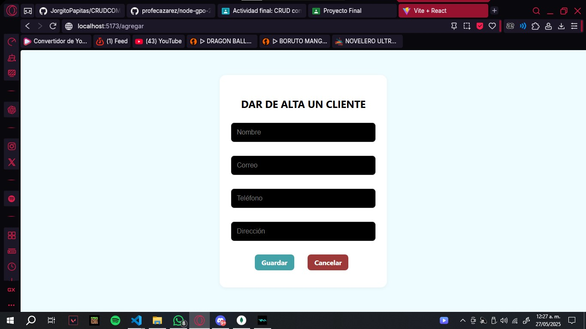
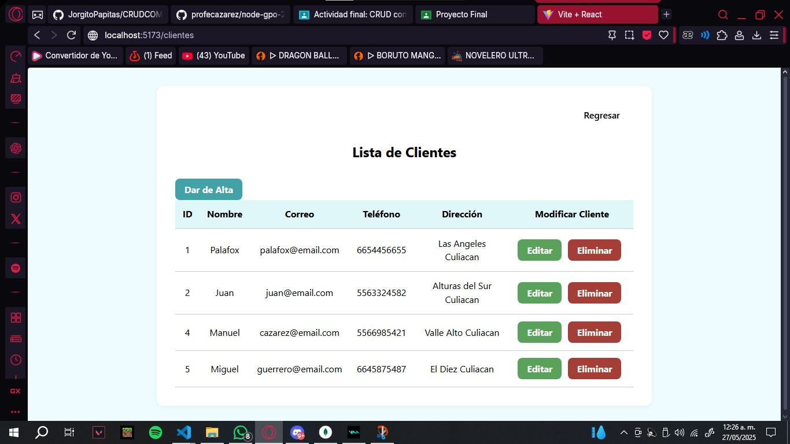

# 📘 Dar de alta a Clientes y Gestion de la base de datos

**Alumno:** Astorga Meza Jorge Luis  
**Fecha:** 28 Mayo 2025  
**Descripción:**   
Este proyecto es una aplicación web simple que permite gestionar clientes mediante un frontend en React y un backend en Node.js con Express y Sequelize. Permite realizar operaciones básicas de CRUD (Crear, Leer, Actualizar y Eliminar).
A medida que fue creciendo el proyecto se fueron agregando mas cosas que me pudieron ayudar a lograr cosas buenas (como reutilizar las rutas en react del semestre pasado). 

---

## 📸 Capturas de la Aplicación

### Vista principal

### Formulario de nuevo cliente

### Tabla de clientes

---

## 🧠 Explicación del Código

### 🔧 ¿Qué hace mi proyecto?

- Muestra una lista de clientes.
- Permite agregar nuevos clientes con un formulario.
- Se pueden editar o eliminar clientes desde la interfaz.
- Toda la información se guarda en una base de datos SQLite, manejada con Sequelize.

### 📁 Estructura general

- **Frontend (React):**
  - Componentes simples, diseño minimalista.
  - uso de css e importaciones de codigo del semestre pasado
  - Estilo limpio con fondo cyan muy claro y tarjetas blancas.
  - `fetch` se usa para consumir la API.
  
- **Backend (Node.js):**
  - Usa Express para manejar las rutas.
  - Sequelize para interactuar con la base de datos de dbbrowser SQLite.
  - Solo tiene el modelo de `Cliente`.

---

## 🛠️ Tecnologías utilizadas

- React
- Node.js
- Express
- Sequelize
- SQLite3
- Cors (para la conexion de la api con el frontend)
- jwt (jsonwebtoken)

---

## 📂 Actividad Final CRUD
