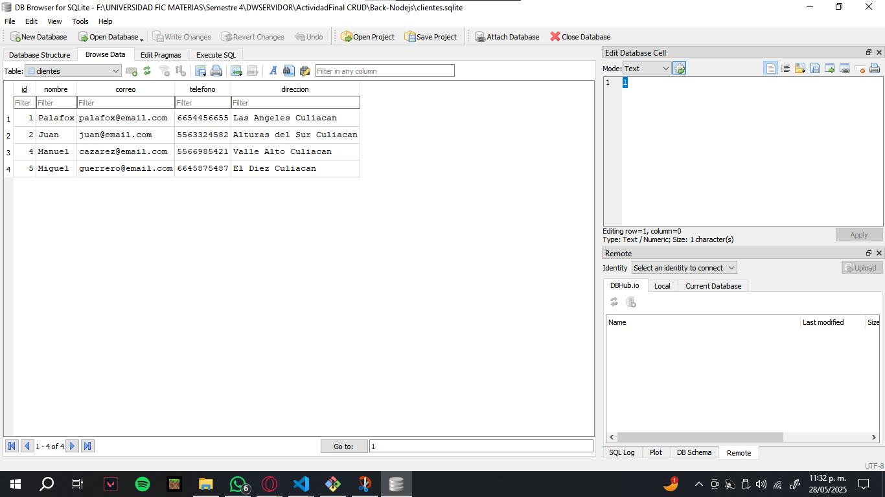

# 📘 Dar de alta a Clientes y Gestion de la base de datos

**Alumno:** Astorga Meza Jorge Luis

**Grado y Grupo:** 2-3

**Fecha:** 29 Mayo 2025

**Descripción:**   
Este proyecto es una aplicación web simple que permite gestionar clientes mediante un frontend en React y un backend en Node.js con Express y Sequelize. Permite realizar operaciones básicas de CRUD (Crear, Leer, Actualizar y Eliminar). A medida que fue creciendo el proyecto se fueron agregando mas cosas que me pudieron ayudar a lograr cosas buenas (como reutilizar las rutas en react del semestre pasado). Al final del README viene el link para descargar el PDF de la documentación del codigo.

---

## 📸 Capturas de la pagina web

### Vista de login (con JWT)

### Vista principal

### Formulario de nuevo cliente

### Tabla de clientes

### Datos verdaderos de que hay conexion con la BD

---

## 🧠 Explicación del Código

### 🔧 ¿Qué hace mi proyecto?

- Permite logearse usando a un token como acceso a la base de datos y tabla con datos.
- Muestra una lista de clientes.
- Permite agregar nuevos clientes con un formulario.
- Se pueden editar o eliminar clientes desde la interfaz.
- Toda la información se guarda en una base de datos SQLite, manejada con Sequelize.

### 📁 Estructura general

- **Frontend (React):**
  - Componentes simples, diseño minimalista.
  - uso de css e importaciones de codigo del semestre pasado.
  - Estilo limpio con fondo cyan muy claro y tarjetas blancas.
  - `fetch` se usa para consumir datos enviados de la API.
  
- **Backend (Node.js):**
  - Hace uso de jwt (Json Web Token) para protección.
  - Usa Express para manejar las rutas.
  - Sequelize para interactuar con la base de datos de dbbrowser SQLite.
  - Solo tiene el modelo de `Cliente`.

---

## 🛠️ Tecnologías utilizadas

- React
- Node.js
- Express
- Sequelize
- SQLite3
- Cors (para la conexion de la api con el frontend)
- jwt (jsonwebtoken)
- useState, useEffect, useNavigate.
- BrowserRouter, Routes, Route.

---

## 📂 Actividad Final CRUD + JWT - PDF CON EXPLICACION DE CODIGO (VISUAL STUDIO)
DESCARGAR PDF 
--------> [Explicación del Código FrontEnd y BackEnd](./Documentacion/Explicacion%20del%20Codigo%20FrontEnd%20y%20BackEnd.pdf)
